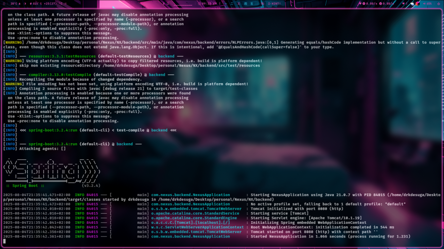
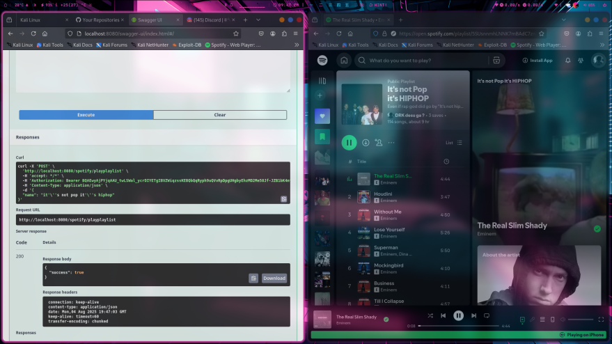
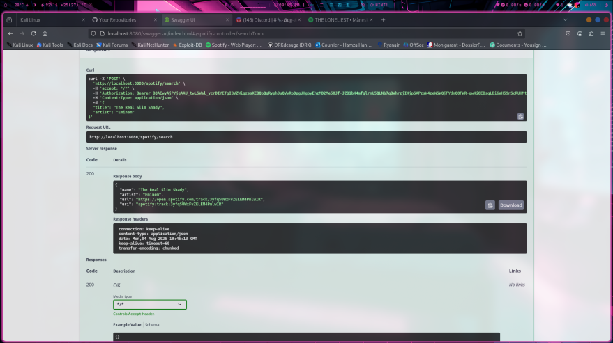
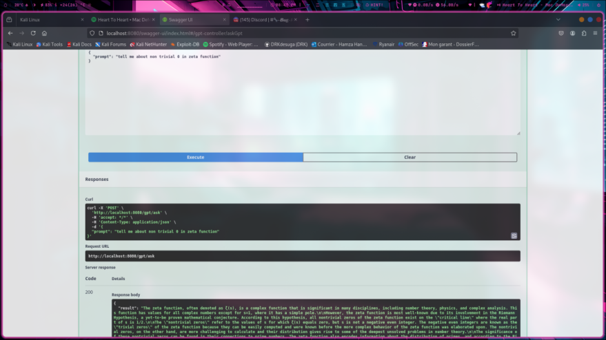
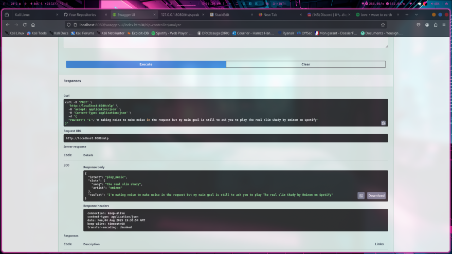

# 🎧 Nexus Backend – Java Spring Boot API

This project is the backend for **Nexus**, a smart assistant application currently under development.  
It provides endpoints to interact with **Spotify**, **OpenAI GPT**, and more features coming soon.

Built with **Spring Boot**, this REST API is designed to be modular, extensible, and easy to integrate with a frontend.

---

## 🚧 Project Status

> **This project is still under active development.**  
We are gradually implementing and testing one feature at a time.  
The backend is cleanly layered (controller → service → dto/errors) to ease future expansion.

---

## ⚙️ Tech Stack

- Java 17  
- Spring Boot  
- Spring Web  
- WebClient (non-blocking HTTP)  
- OpenAPI / Swagger UI  
- Maven  

---

## 🔐 Configuration

Before running the project, ensure the following environment variables are set in your `application.properties`:

```properties
# Spotify configuration
spotify.client.id=your_spotify_client_id
spotify.client.secret=your_spotify_client_secret
spotify.redirect.uri=http://localhost:8080/spotify/callback

# GPT key
gpt.key=your_openai_api_key
```

---

## 📦 Available Features

### 🎵 Spotify Integration  
All Spotify features require a valid OAuth access_token.  
Use `/spotify/login` to start the authentication flow.

#### 1. Login to Spotify  
**GET** `/spotify/login`  
→ Redirects to Spotify auth screen

#### 2. Handle Callback  
**GET** `/spotify/callback?code=...`  
→ Exchanges code for access_token and refresh_token

#### 3. Search Track  
**POST** `/spotify/search`  
Headers:
```
Authorization: Bearer <token>
```
Body:
```json
{
  "title": "The Real Slim Shady",
  "artist": "Eminem"  // optional
}
```
Returns the first matching track (name, artist, uri, Spotify link).

#### 4. Play a Track  
**POST** `/spotify/play`  
Headers:
```
Authorization: Bearer <token>
```
Body:
```json
{
  "uri": "spotify:track:..."
}
```
Starts playback of the given track URI.

#### 5. Pause Playback  
**POST** `/spotify/pause`  
Headers:
```
Authorization: Bearer <token>
```
Pauses current playback.

#### 6. Next Track  
**POST** `/spotify/next`  
Headers:
```
Authorization: Bearer <token>
```
Skips to the next track.

#### 7. Previous Track  
**POST** `/spotify/previous`  
Headers:
```
Authorization: Bearer <token>
```
Returns to the previous track.

#### 8. Play a Playlist by Name  
**POST** `/spotify/playplaylist`  
Headers:
```
Authorization: Bearer <token>
```
Body:
```json
{
  "name": "mood booster"
}
```
Finds and plays the user's playlist that best matches the given name (fuzzy match allowed).  
Even partial matches like `"booster"` or `"mood"` can trigger `"Mood Booster"`.

---

### 🤖 GPT Integration  
Use OpenAI's GPT models to get intelligent responses via REST.

#### 9. Prompt GPT  
**POST** `/gpt/ask`  
Body:
```json
{
  "prompt": "Tell me a joke about Java developers."
}
```
Returns a short response from GPT (GPT-4.1).  
You can ask questions, generate text, summaries, etc.

---

## 🛠️ How to Run

1. Clone the repository  
2. Add your credentials to `application.properties`  
3. Run the app using your IDE or:
```bash
mvn spring-boot:run
```

- You can also use Docker, make sure Docker and Docker Compose are installed.

```bash
docker-compose up --build
```
✅ Notes:
- The Dockerfile builds the app using maven:3.9.4-eclipse-temurin-21 and runs it using eclipse-temurin:21-jdk-alpine.

- The application.properties file must be baked into the image under src/main/resources/. Make sure it's correctly copied before the mvn package phase.

- You can also mount your application.properties from the host using a Docker volume if needed.

4. Visit Swagger UI:  
[http://localhost:8080/swagger-ui/index.html](http://localhost:8080/swagger-ui/index.html)

---

## 📌 Notes

- The backend does not store tokens or sessions yet — all tokens are passed in requests.  
- All responses are wrapped in well-structured DTOs.  
- This is the backend only — the frontend (Angular) is still under development.

---

## 📅 Upcoming Features

- Spotify queue management  
- Alarm & reminder API  
- Full voice assistant loop  
- Database integration  
- User profile support

---
## 🖼️ Screenshots







---

## 👨‍💻 Author

Developed by **DRK** | [GitHub](https://github.com/DRKdesuga)


